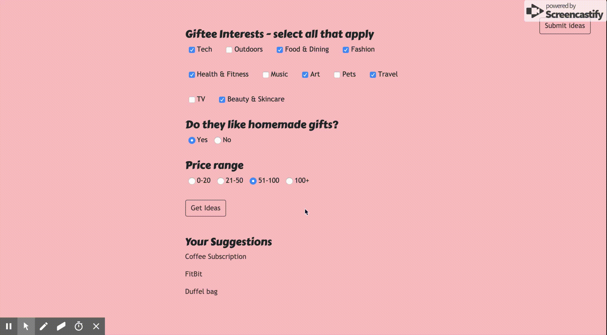

# gift-finder

## Overview
The idea behind this app is to make it easier for users to get gift ideas. Ideas (aside from initial data) come from user input and the goal of the project is to have users enter their own ideas so that others can draw from them as well.

## Tech used
Node, Express, MySQL, Sequelize, Animate.css, Bootstrap

## Getting Started

Navigate to the [homepage](https://giftwizard.herokuapp.com/).

Clicking **Get Started** will take you to the survey page, as shown:

The gift ideas are filtered through the criteria provided by the user. Input validation is used to prevent fields from being left empty.

**Submitting Ideas**

Since having a wide variety of gift ideas is the basis of the app, users are encouraged to submit their ideas as well.

## Future updates
* Adding more gift categories
* Enabling user to select more than one price range, ex: 0-50
* Admin account requiring log in to review gift ideas before they are added
* Option to have gift ideas sent via email or text in one click
* Full mobile responsiveness